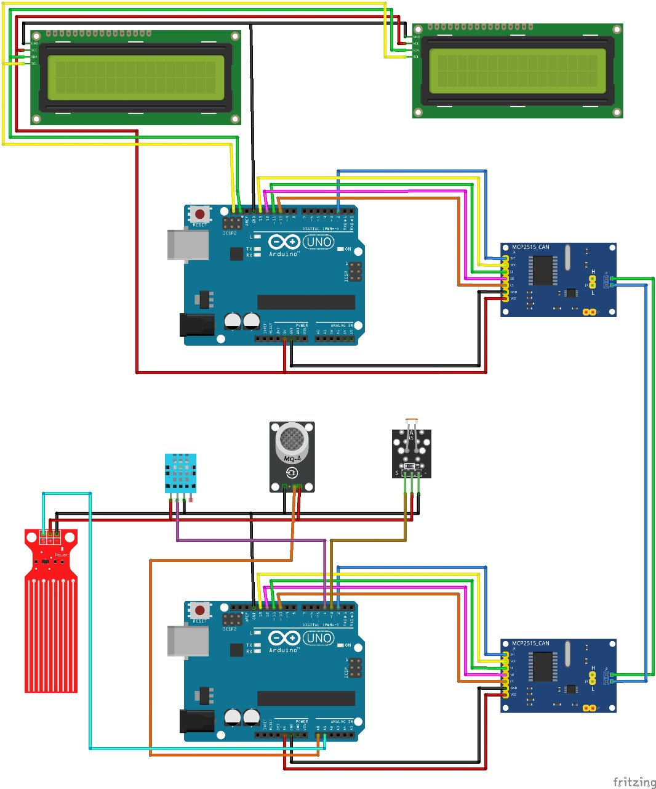

# CAN Protocol with Arduino Uno and MCP2515 module

This project demonstrates how to use the CAN protocol with an Arduino Uno, MCP2515 CAN Bus Module, DHT sensor (temperature and humidity sensor),Gas sensor(To check quality of air) ,Water Sensor(To check Fuel Quantity),LDR Sensor (For automatic working of Lights of car) and I2C LCD display. The system reads the temperature and humidity from the DHT sensor and sends this data over the CAN bus to other devices, while displaying the current readings on the LCD.

**Components Used**
 - Arduino Uno: Microcontroller for controlling the project.
 - MCP2515 CAN Bus Module: CAN transceiver to send and receive CAN messages.
 - DHT11 or DHT22 Sensor: Measures temperature and humidity.
 - MQ 5 Gas Sensor: Measures the presence of CO2.
 - SEN18 Water Sensor: Measures the quantity of Water.
 - LDR Sensor: Operates on the basis of light rays.
 - I2C LCD Display: Displays the temperature and humidity readings.
 - Jumper Wires: For connections.
 - Breadboard: For connecting components.
 - Power Supply: Typically USB power for Arduino Uno

   
**Features**
 - CAN Communication: Transmits temperature and humidity data via the CAN bus.
 - Sensor Data: Reads temperature and humidity from the DHT sensor.
 - Real-time Display: Displays current temperature and humidity on an I2C LCD.
 - Modular Design: Easily expand the project to include more sensors or devices communicating over the CAN bus.

**Circuit Diagram**

**Wiring**

**1. MCP2515 CAN Bus Module to Arduino Uno**
 - VCC -> 5V (Arduino Uno)
 - GND -> GND (Arduino Uno)
 - CS -> Pin 10 (Arduino Uno)
 - SCK -> Pin 13 (Arduino Uno)
 - MOSI -> Pin 11 (Arduino Uno)
 - MISO -> Pin 12 (Arduino Uno)
 - INT -> Pin 2 (Arduino Uno)

   
**2. DHT11/DHT22 Sensor to Arduino Uno**
 - VCC -> 5V (Arduino Uno)
 - GND -> GND (Arduino Uno)
 - Data -> Pin 8 (Arduino Uno)

**3. I2C LCD to Arduino Uno**
 - VCC -> 5V (Arduino Uno)
 - GND -> GND (Arduino Uno)
 - SDA -> SDA (Arduino Uno)
 - SCL -> SCL (Arduino Uno)

**Libraries Used**
 - mcp2515: For interfacing with the MCP2515 CAN Bus module.
 - DHT Sensor Library: For reading data from the DHT sensor.
 - LiquidCrystal_I2C: For controlling the I2C LCD display.

**Code Overview**
This project reads data from the DHT sensor, formats it into a CAN message, and sends it over the CAN bus. Additionally, it displays the temperature and humidity readings on the I2C LCD 
